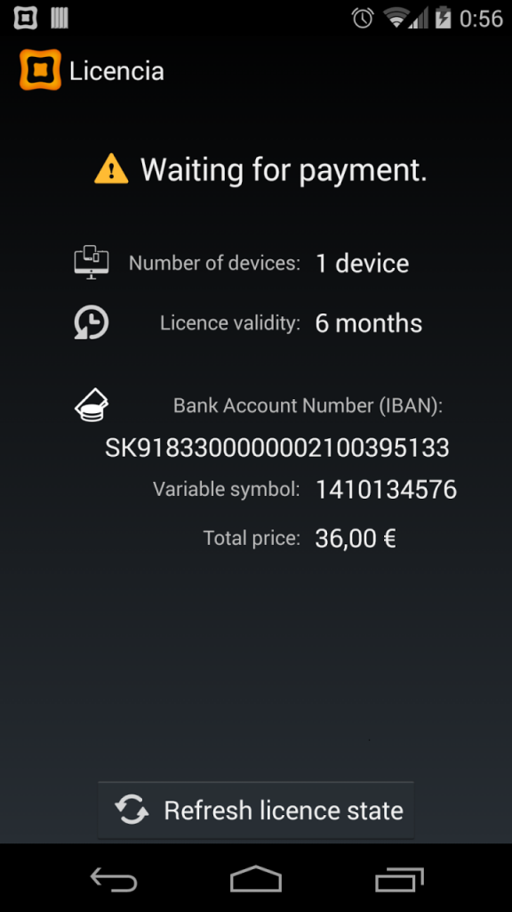
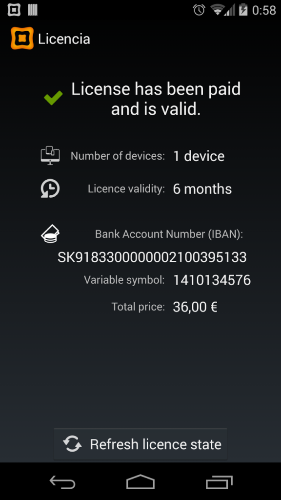

# Zakúpenie licencie Papaya Oberon

* Čerstvo nainštalovaná Papaya aktivovaná voči Oberonu funguje v demo móde. V demo móde si môže zákazník vyskúšať všetky funkcie Papaye. Niektoré funkcie však fungujú v obmedzenom režime. Pre plnohodnotné používanie si musí zákazník zakúpiť licenciu.

* Len Papaya, ktorá je už aktivovaná voči Oberonu má sprístupnenú obrazovku **Nastavenia -> Licencia**, v ktorej si môže zákazník licenciu zakúpiť.

* Zariadenie, ktoré žiada licenciu pre konkrétnu inštaláciu Oberon musí byť pripojené k Internetu.

* Zariadenie musí mať v dosahu inštaláciu Oberonu, voči ktorej je Papaya aktivovaná.

## Postup

1. **Žiadost o licenciu:** Zvoľte počet zariadení, na ktorých chcete Papayu používať, a počet mesiacov (minimálne 1).
4. **Kontaktné údaje:** Následne potvrďte vaše kontaktné údaje (e-mail a telefónne číslo). Uveďte identifikátor (názov) servisného strediska, kvôli zrýchleniu celého procesu v prípade problémov. Tento údaj je nepovinný.
2. **Platba:** Po vyplnení údajov sa zobrazí objednávkové číslo spolu s inštrukciou na úhradu licencie bankovým prevodom.
    * Zaplatenie licenčného poplatku - bankový prevod vykoná zákazník.
    * Vystavenie faktúry zo strany qnd s.r.o. a zaslanie na e-mail uvedený v Žiadosti o licenciu vykoná qnd s.r.o. po prijatí úhrady.
    * Vystavenie licencie po úhrade vykoná qnd s.r.o.
5. **Stiahnutie pridelenej licencie:** Zvolením menu **Nastavenia -> Licencia** sa stiahne zakúpená licencia, alebo stlačením tlačítka **Obnoviť (Refresh)** v tejto obrazovke.

### Žiadosť a stiahnutie licencie v krokoch

<b>1.</b> Žiadosť o licenciu

<b>2.</b> Kontaktné údaje

<b>2.</b> Platba

<b>4.</b> Licencia pridelená

