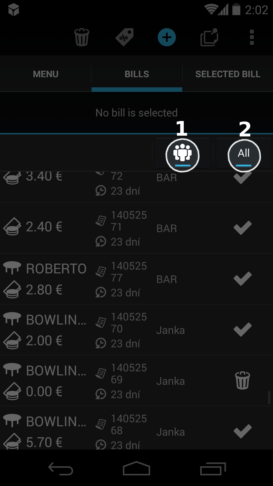

## Práca s účtom

### Aktívny účet
V Papayi je spomedzi všetkých účtov aktívny iba jeden.

Aktívny účet je taký účet,

1. na ktorý sa pridávajú položky po kliknutí na menu
1. ktorého kompletný obsah je zobrazený v záložky *Aktívny účet*
1. ktorý je označený v zozname účtov
1. ktorého základné informácie - názov, suma - sú neustále viditeľné v hlavičke

### Vytvorenie nového účtu
Nový účet možno vytvoriť 2 spôsobmi:

1. Kliknutím na modrú ikonku + (plus). Ikonka je zobrazená iba v režime pultového predaja.
2. Kliknutím na ľubovoľnú menu položku ak nie je žiadny účet aktívny. Menu položka sa na účet po jeho vytvorení automaticky pridá.

Novo vytvorený účet sa automaticky stane aktívnym.

### Stav účtu

1. **Otvorený** - Otvoreným účtom je každý novo vytvorený účet. V zozname účtov nie je označený žiadnou špecifickou ikonkou a je v zozname stále viditeľný.
* **Uzavretý** - Používateľ otvorený účet uzavrel kliknutím na ikonku *peňazí* a následným potvrdením platobného dialógu. Takýto účet je v zozname účtov označený plnou ikonkou *check*.
* **Zrušený** - Používateľ otvorený účet zrušil kliknutím na ikonku smetného koša. Účet je v zozname účtov označený rovnako ikonkou *smetného koša*.
* **Nevytlačený** - Účet je uzavretý, avšak nepodarilo sa k nemu správne vytlačiť účtenku (napr. z dôvodu nesprávne zapojenej tlačiarne). Účtenka môže byť pre tento účet opätovne vytlačená. Takýto účet bude v zozname označený červenou ikonkou *tlačiarne*.
* **Zaparkovaný** – Účet s odloženou úhradou. Používateľ takýto účet vytvorí tým, že po kliknutí na ikonku *peňazí* na otvorenom účte nezadá platbu, ale klikne na ikonku *hodín*. Takýto účet je v zozname účtov označený „prázdnou“ ikonkou *check*. V budúcnosti je taký účet možné pri prijatí platby štandardne uzavrieť, čím sa jeho stav zmení na „Uzavretý“.

### Vlastník účtu

Vlasntíkom účtu je pracovník/čašník, ktorý účet vytvoril. Zoznam účtov možno potom [filtrovať](./praca_s_uctom.html#filtrovanie-zoznamu-tov) podľa toho, kto je jeho vlastníkom.

**Pozor:** Z *účtovného* pohľadu je za peniaze prijaté od zákazníka zodpovendný ten používateľ, ktorý účet uzavrel a nie ten, ktorý ho vytvoril. Viac informácii v sekcií [Účtovné obdobia a smeny](../uctovne_obdobia_a_smeny/README.html).

### Názov účtu
Štandardne priraďuje Papaya každému účtu unikátne číslo - unikátny názov. Ten sa zobrazuje v zozname účtov a tlačí sa aj na objednávku/bon.

Ak chcete, môžete účtu nastaviť aj čitateľný názov ako napr. "Rodinná oslava" alebo "Kamoši z dvora". Takýto účet potom jednoduchšie nájdete v zozname.

V režime otvorených účtov možno názov zadať už pri vytváraní účtu. Ten môžete neskôr zmeniť dlhým klikom na účet v zozname. Názov môžete rovnako meniť aj v režime pultového predaja.

### Priradenie účtu na stôl

Pre reštaurácie je určená funkcia priraďovania účtu na konkrétny stôl.

V režime otvorených účtov možno stôl nastaviť už pri vytváraní účtu. Ten môžete neskôr zmeniť dlhým klikom na účet v zozname. Stôl môžete účtu nastaviť aj v režime pultového predaja - i keď túto funkcionalitu budete využívať len vo výnimočnom prípade, keďže štandardne sa účet uzatvára hneď pri predaji na pulte.

### Zrušenie účtu

Zrušiť možno iba [aktvívny](./praca_s_uctom.html#aktvny-et) [otvorený](./praca_s_uctom.html#stav-tu) účet.

Na zrušenie aktívneho otvoreného účtu stačí kliknúť na ikonku *smetného koša*. [Zrušené](./praca_s_uctom.html#stav-tu) alebo už [uzavreté](./praca_s_uctom.html#stav-tu) účty nie je možné zrušiť.

### Filtrovanie zoznamu účtov

Zoznam účtov možno filtrovať kliknutím na tlačítka v nacházdajúce sa v hlavičke zoznamu účtov. Filter pomáha čašníkom vyhľadať konkrétny účet hlavne v situácií, keď máte v prevádzke plno. V súčastnosti je k dispozícií filtrovanie podľa:

1. [vlastníka účtu](./praca_s_uctom.html#vlastnk-tu) (dostupné vo verziách [Mini a Pro](../verzie_systemu_papaya/README.html))
1. [stavu účtu](./praca_s_uctom.html#stav-tu) (dostupné vo verziách [Mini, Pro a Oberon](../verzie_systemu_papaya/README.html))

