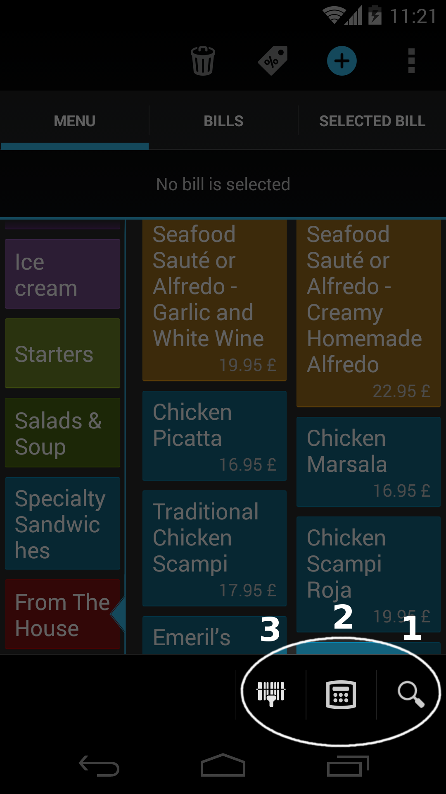
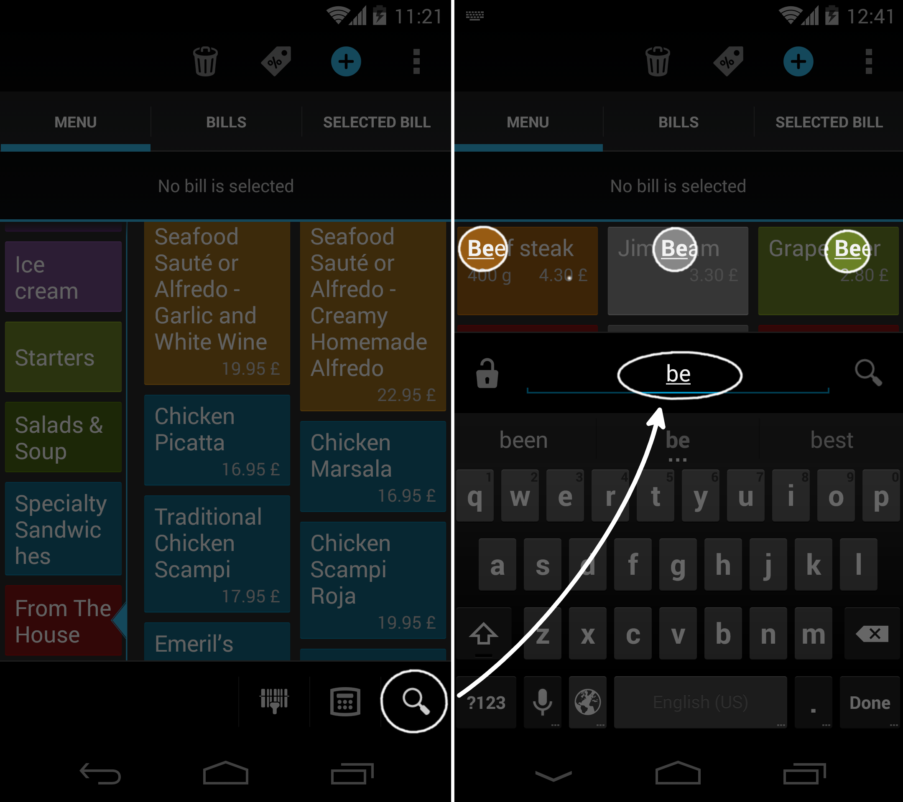
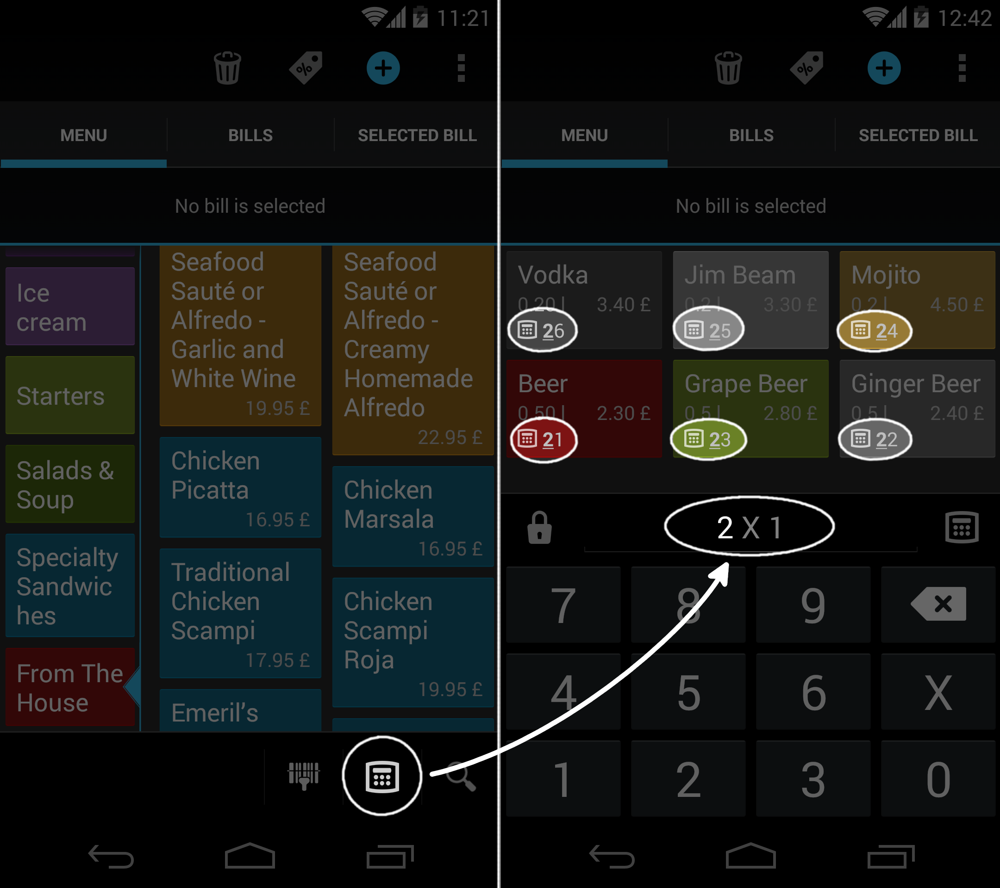
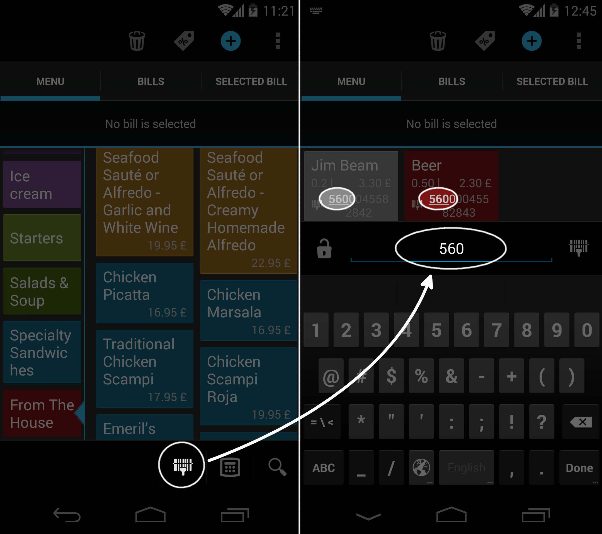

# Vyhľadávanie v menu

Rýchlosť navigácie v menu je pri predaji kritickou funkciou. Papaya vám poskytuje hneď 4 spôsoby na to, ako predávanú menu položku rýchlo vyhľadať.

1. **Fulltextovo** (zadaním názvu menu položky)
- **Zadaním PLU kódu**
- **Načítaním čiarového kódu** čítačkou/skenerom
- **Manuálne**

## Fulltextové vyhľadávanie

Menu položky môžete v Papayi vyhľadávať fulltextovo.

- Výsledky vyhľadávania sa zobrazujú instantne počas toho, ako používateľ zadáva hľadaný výraz. Šetrí to čas, pretože často už po napísaní prvých dvoch písmen má používateľ k dispozícii na výber ibá zopár menu položiek.
- Papaya vyhľadáva menu položky podľa ich názvu. Popis položky pri vyhľadávaní nehrá rolu.
- Používateľ môže položky vyhľadávať bez nutnosti zadávať diakritiku alebo bez toho aby musel rozlišovať veľké a malé písmená.
- Ak si používateľ praje používať primárne tento spôsob vyhľadávania, tak ho môže uzamknúť kliknutím na ikonku zámku. Ak nie je fulltextovné vyhľadávanie uzamknuté, tak sa tento režim automaticky prepne na manuálne vyhľadávanie po pridaní menu položky na účet.

## Vyhľadávanie cez PLU kódy

Aj keď PLU kódy mnohí považujú za prežitok, jedná sa o veľmi efektívny spôsob pridávania menu položiek na účet. V princípe jedinou nevýhodou tohoto prístupu je, že si používateľ musí pamätať kódy všetky naspamäť. Papaya práve preto vyhľadáva položku cez PLU kódy trochu inak ako konvenčné systémy. Používateľ si s Papayou nemusí za každú cenu pamätať celý PLU kód. Stačí si pamätať zopár prvých čísel.

- Podobne ako pri fulltextovom vyhľadávaní zobrazuje Papaya instantne výsledky vyhľadávania počas toho, ako používateľ kód zadáva. V prípade dlhších kódov je potom pre používateľa výhodnejšie zadať prvých pár cifier kódu a následne vybrať vyhľadanú položku z menu.
- Ak si používateľ praje používať primárne tento spôsob vyhľadávania, tak ho môže uzamknúť kliknutím na ikonku zámku. Ak nie je vyhľadávanie cez PLU uzamknuté, tak sa tento režim automaticky prepne na manuálne vyhľadávanie po pridaní menu položky na účet.

## Vyhľadávanie cez čiarové kódy

Tento spôsob vyhľadávania je určený primárne pre používateľov, ktorý vlastnia skener/čítačku čiarových kódov.

**Tip:** Prečítajte si o tom, ako [pripojiť skener](../periferie/skener_ciarovych_kodov.html) k tabletu/mobilu.

- Pri oskenovaní kódu sa položka automaticky pridá na účet.
- Ak je však k jednému kódu priradených viacero menu položiek, tak sa po oskenovaní tieto duplicitné položky zobrazia a používateľ musí ručne vybrať tú, ktorá sa má pridať na účet.
- Ak sa kód nedarí naskenovať, tak je možné zadať ho ručne. Papaya položku vyhľadáva instantne počas zadávania kódu, preho ho často nie je potrebné opísať celý, čo výrazne šetrí čas.
- Ak si používateľ praje používať primárne tento spôsob vyhľadávania, tak ho môže uzamknúť kliknutím na ikonku zámku. Ak nie je vyhľadávanie cez čiarové kódy uzamknuté, tak sa tento režim automaticky prepne na manuálne vyhľadávanie po pridaní menu položky na účet.

## Manuálne vyhľadávanie

Papaya organizuje menu položky do menu kategórií. Menu sa preto zobrazuje ako dvojúrovňový zoznam.

- Akúkoľvek menu položku viete pridať na účet na 2 kliky.
- V prípade, že menu položku podržíte dlhšie, viete jej zadefinovať napr. poznámku pre kuchára
- Menu kategórie ako aj menu položky môžete kvôli lepšej prehľadnosti farebne odlíšiť.

Manuálne vyhľadávanie je veľmi jednoduché na použitie. Má však nevýhodu v prípade, keď máte v menu príliš veľa položiek. Pre túto situáciu sú vhodné ďalšie spôsoby vyhľadávania.
