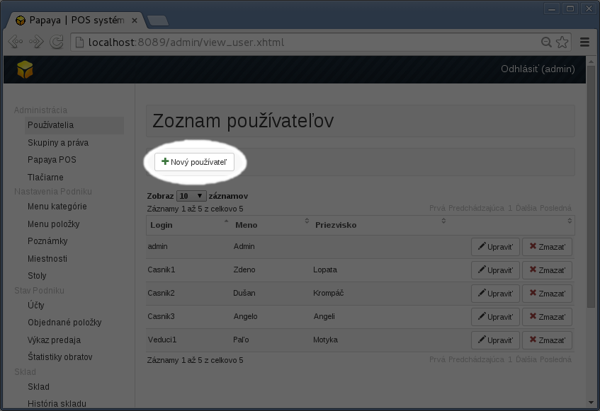
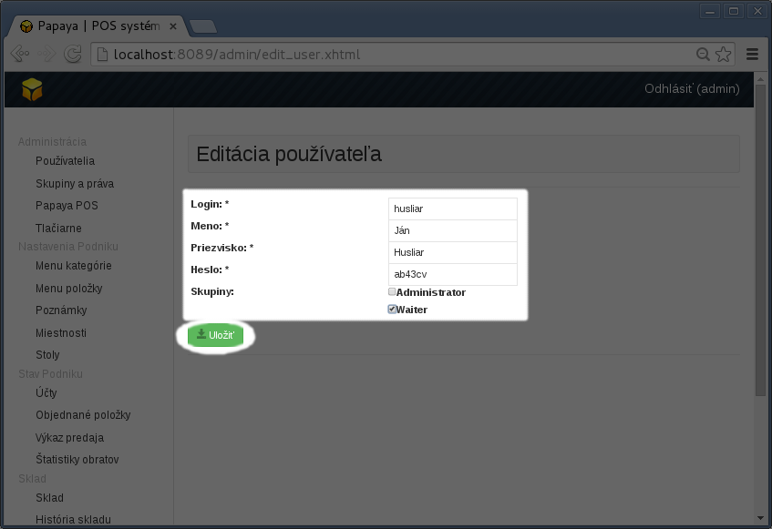
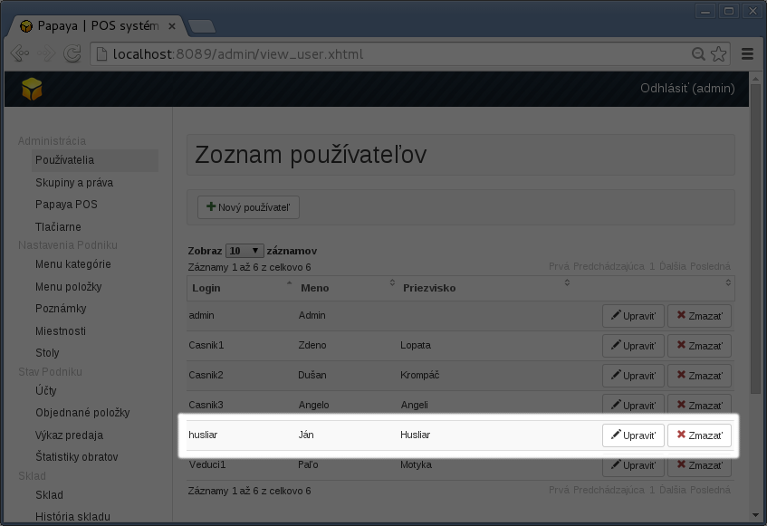

# Oprávnenia a používatelia

## Papaya Mini

- Správu používateľov pre Mini verziu pripravujeme.
- V súčasnosti je v Mini verzii prednastavený jeden používateľ - administrátor, ktorý má oprávnenie na všetky operácie.

## Papaya Pro

Používatelia a ich oprávnenia sa spravujú cez web administračné rozhranie - *WebAdmin*.

### Používatelia

- Používateľovi sa oprávnenie priamo nepriraďuje.
- Používateľ môže byť pridaný do jednej alebo viacerých skupín. Používateľ má potom oprávnenia podľa toho, do akej skupiny je priradený.

### Skupiny a oprávnenia

- Skupiny majú **názov** a **zoznam oprávnení**.
- Počet skupín nie je obmedzený. Prevádzkar si ich môže vytvoriť koľko potrebuje (čašník, vedúci smeny, a pod.).
- Skupinu **admin/administrátor** nie je možné vymazať. Táto skupina má nastavené vždy všetky oprávnenia.

### Postup pre pridanie nového používateľa

- Prihlásiť sa do *WebAdmina*

- V menu **Zoznam používateľov** kliknúť na ikonku **Nový používateľ**.

- Vyplniť prihlasovacie údaje (login, meno, priezvisko, heslo). **Nezabudnite používateľa priradiť do skupiny!**

- Po kliknutí na Uložiť sa nový používateľ vytvorí pridá do zoznamu. Možno ho neskôr vymazať alebo upraviť.

## Papaya Oberon

V tejto verzii funguje Papaya výlučne iba ako **Mobilný čašník**. Všetky nastavenia je nutné robiť cez systém Oberon. Papaya si žiadne dáta neuchováva, iba zobrazuje dáta uložené v Oberone. Pre informácie o správe používateľov prosím kontaktujte podporu Oberonu.
