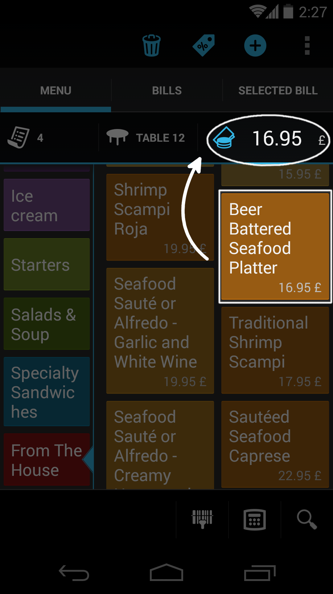
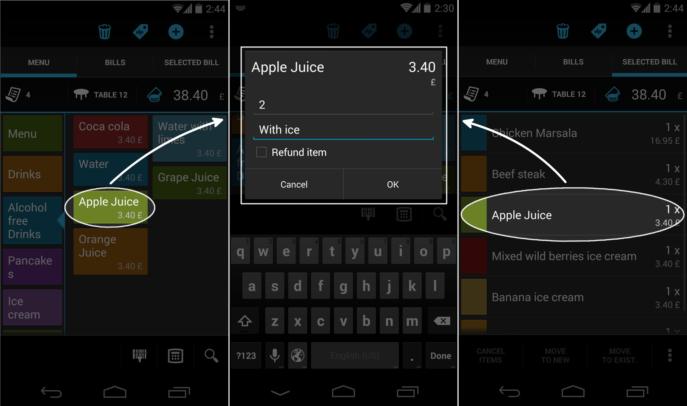
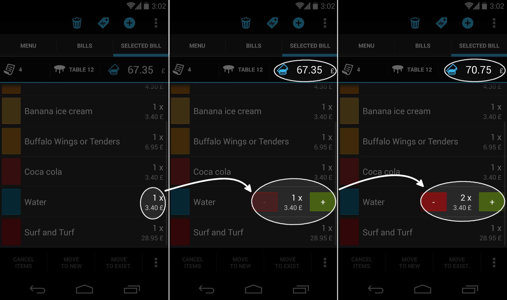

## Práca s položkami na účte

### Pridanie novej položky na účet
Položky sa pridávajú na účet kliknutím na položku v menu.

Ak nie je v čase kliknutia na menu položku žiadny účet [aktívny](../sprava_uctov/praca_s_uctom.html#aktvny-et), tak sa najprv vytvorí nový. V režime pultového predaja vytvorí Papaya účet automaticky a používateľa ničím neotravuje. V režime otvorených účtov vás systém najprv vyzve na výber stola, na ktorý chcete účet priradiť.

#### Rýchly klik na položku v menu
Rýchlim kliknutím na menu položku pridáte 1 kus položky na aktívny účet.

#### Dlhšie podržanie položky v menu
Po dlhšom podržaní menu položky sa zobrazí okno, ktoré je určené na zadanie počtu položiek a na zadanie poznámky k objednávke. Tento prístup vám ušetrí čas napr. pri objednávke typu: 3 jemne sýtené chladené minerálky.

### Zmena množstva a úprava poznámky

Pri každej položke na účte sa zobrazuje okrem jej názvu, ceny, ... aj *množstvo* a *poznámka*.

Množstvo a poznámku položky na účte možno upraviť dlhším podržaním položky na účte. Zobrazí sa okno, v ktorom viete detailne upraviť údaje danej položky.

1. **Množstvo** násobí cenu položky na účte. Rovnako sa však tlačí aj na bon/objednávku (v prípade, že vo vašej prevádzke používate bonovaciu tlačiareň).
- **Poznámka** sa taktiež tlačí na bon/objednávku. Štandardne sa do poznámky dáva informácia o spôsobe prípravy - napr. pri objednaní minerálky nás zaujíma či je *chladená*.

Na úpravu množstva položiek na účte má Papaya k dispozícii aj alternatívny spôsob, ktorý je oproti predošlému rýchlejší ak chcete pridať na účet iba zopár položiek:

1. Zobrazte si obsah účtu.
- Kliknite na text reprezentujúci počet položiek na účte.
- Zobrazia sa tlačítka +/-, ktorými môžete počet pohodlne meniť.

### Informácie o položke
Obsluha si môže na tablete zobraziť podrobnejší popis položky či - v prípade pokrmov alebo miešaných nápojov - jej receptúru. V prípade záujmu tak vie zákazníkovi poskytnúť napr. informácie o zložení či postupe prípravy daného pokrmu. Pre zobrazenie týchto informácii stačí vybranú menu položku dlhši podržať - zobrazí sa okno s troma záložkami.
- Prvá umožňuje zadať počet položiek v prípade objednávky (viz predchádzajúci bod)
- V druhej záložke sa zobrazí popis položky (detailnejší popis daného tovaru)
- Tretia záložka obsahuje receptúru, ak v prípade danej položky ide o pokrm alebo miešaný nápoj

Detailnejší popis položky a receptúra sa zobrazia, iba ak sú pre danú menu položku zadané. Zadávať ich je možné v procese "[Editácie menu položiek](../editacia_menu/editacia_menu_na_tablete.html#editcia-existujcej-menu-kategrie-a-poloky)".

### Zrušenie položky

Položku na účte je možné zrušiť iba v prípade, ak sa nachádza na [otvorenom účte](../sprava_uctov/praca_s_uctom.html#stav-tu).

1. Označte jednu alebo viacero položiek na účte.
1. V spodnej časti obrazovky sa sprístupnia tlačidlá na manipuláciu s označenými položkami.
1. Kliknite na ikonku *Zrušiť položku*.

#### Zrušenie vybonovanej/nevybonovanej položky

Ak používate vo vašej prevádzke [bonovaciu tlačiareň](../periferie/bonovacia_tlaciaren.html), tak sa zrušená položka bude zobrazovať na účte v závislosti od toho či bola alebo nebola vybonovaná.

* **Zobrazovanie nevybonovanej položky** Položka, ktorá zatiaľ nebola vybonovaná, sa na účte po jej zrušení nezobrazuje. Dôvodom je, že nevybonované položky sa nepovažujú za záväzné - teda kuchár ani barman ešte nedostali žiadnu objednávku. To, že sa po zrušení takéto položky na účte nezobrazujú účet sprehľadňuje. V skutočnosti si systém zrušenie každej položky pamätá a majiteľ ju vidí na účte vo Web admine.
* **Zobrazovanie vybonovanej položky** Položka, ktorá už bola vybonovaná, sa považuje za záväznú objednávku. Takáto položka sa na účte bude zobrazovať stále, teda aj po jej zrušení. Na zrušenie vybonovanej položky potrebuje používateľ oprávnenie.

#### Oprávnenie na zrušenie vybonovanej položky

Ak vašim zamestnancom nedôverujete, môžete im odobrať oprávnenie s názvom *Zrušenie vybonovanej položky na účte*. Ideálne by toto oprávnenie mal mať zamestnanec, ktorému dôverujete.

Týmto oprávnením zamedzíte podvodom, keď sa čašník snaží zmazať pár položiek z účtu tesne pred jeho uzavretím. Sumu za zrušené položky by si potom mohol nechať ako neoprávnený tringelt.

Používateľom bez oprávnenia sa po kliknutí na tlačítko *Zrušiť položku* zobrazí notifikácia, položka sa nezruší.
