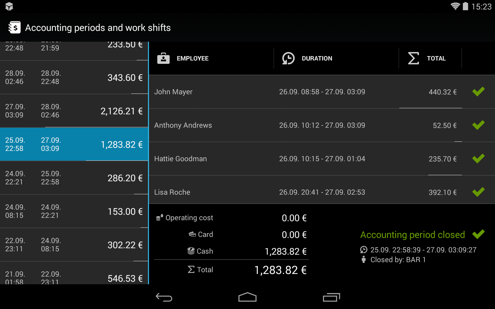

# Účtovné obdobia a smeny

Cieľom tejto funkcie je poskytnúť majiteľovi prevádzky alebo prevádzkarovi informáciu o stave financií v čase, v ktorom sa menia smeny alebo uzatvára celé účtovné obdobie (spravidla jeden deň). Všetky úkony súvisiace so smenami a účtovnými obdobiami sa vykonávajú v obrazovke  **Nastavenia > Účtovné obdobia a smeny**.

## Smena

Smena časové obdobie, v rámci ktorého má zamestnanec zodpovednosť za financie prijaté od zákazníkov.

Papaya eviduje všetky platby prijaté od zákazníkov a pripisuje ich na konto zamestnanca. Po ukončení smeny zamestnanec spravidla odovzdá prijatú hotovosť vedúcemu prevádzky. Tento scenár sa samozrejme môže medzi jednotlivými prevádzkami líšiť.

### Otvorenie smeny

* Smena sa zamestnancovi otvára automaticky pri uzavretí akéhokoľvek účtu.
* Smena sa otvára automaticky každému zamestnancovi bez výnimky.
* Ak zamestnanec už smenu otvorenú má, tak sa suma uzatváraného účtu pripíše na konto existujúcej smeny.

### Uzavretie smeny

* Na uzavretie smeny musí mať používateľ oprávenenie. Väčšinou ho má prevádzkar alebo samotný majiteľ prevádzky.
* Smena sa uzatvára v obrazovke **Nastavenia > Účtovné obdobia a smeny**.
* Smenu možno uzavrieť a opäť otvoriť niekoľko krát v rámci účtovného obdobia. Čas otvorenia a uzavretia smeny nie je ničím obmedzovaný.

**Scenár:** Čašníkovi sa končí smena a chce opustiť pracovisko. Prevádzkar pred uzavretím smeny vidí, že má od čašníka prijať tržbu 20,00 €. Po prijatí tržby mu prevádzkar smenu uzavrie, čím potvrdí, že tržbu od čašníka prijal.

## Účtovné obdobie

Účtovné obdobie vám poskytuje sumárny/celkový pohľad na na tržby za určité obdobie. V účtovnom období vidíte zoznam všetkých smien, ktoré boli v rámci neho otvorené alebo uzavreté.

Účtovné obdobie má v princípe **funkciu dennej uzávierky**. Jediný rozdiel oproti zaužívanej dennej uzávierke je, že účtovné obdobie možno otvárať a uzatvárať v ľubovoľnú chvíľu. Ak sa vám to hodí, tak môžete za účtovné obdobie prehlásiť napríklad celý týždeň.

**Scenár:** Zamestnanec/čašník môže mať v rámci jedného účtovného obdobia viacero smien. Avšak otvorenú smenu bude mať najviac jednu. Napr. ak čašník pracuje od rána do obeda, tak mu smenu prevádzkar na obed uzavrie. Keď ten istý čašník príde večer opäť do práce, tak sa mu po uzavretí prvého účtu automaticky otvorí druhá smena. Tá bude spadať pod to isté účtovné obdobie ako doobedná smena.

### Otvorenie účtovného obdobia

* Účtovné obdobie je otvorené automaticky po otvorení prvej smeny. Teda po uzavretí prvého účtu.
* Účtovné obdobie sa otvorí automaticky bez ohľadu na to, ktorý zamestnanec účet uzavrie. Na začatie účtovného obdobia nie je potrebné žiadne špeciálne oprávnenie.

### Uzavretie účtovného obdobia

* Na uzavretie účtovného obdobia musí mať používateľ oprávnenie. Väčšinou ho má prevádzkar alebo samotný majiteľ prevádzky - rovnako ako pri správe smien.
* Účtovné obdobie sa uzatvára v obrazovke **Nastavenia > Účtovné obdobia a smeny**.
* Uzavretím účtovného obdobia sa uzavrú aj všetky smeny, ktoré do obdobia spadajú.
